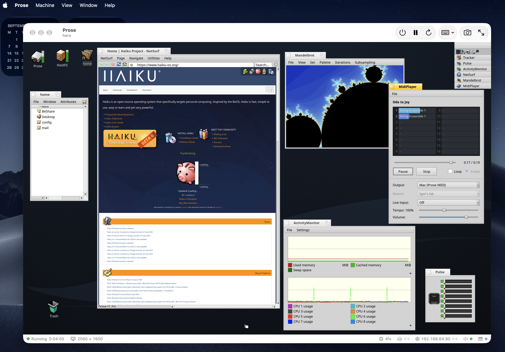

# prose

An unofficial, experimental port of the Haiku operating system to Apple Silicon,
running under macOS 27's Virtualization.framework with a host-GPU-backed display.



> **This is not Haiku.** Haiku itself — the real thing, and very much worth your
> time — is at **[haiku-os.org](https://www.haiku-os.org)**.

*This repo does not accept issues, does not accept pull requests. Open source,
please do fork, copy, rewrite and reuse.*

---

## Why "prose"?

prose is an experiment that owes everything to Haiku, the open-source
operating system carrying on the spirit of BeOS. The name is a small nod to
that: where Haiku is poetry, this is prose. It is meant as a mark of respect and
appreciation, not as a claim of any connection.

I've kept the Haiku name out of this project on purpose, for two reasons.

**The Haiku name belongs to the Haiku project.** Haiku® is a registered
trademark of Haiku, Inc., and the project asks that independent work not use the
name in a way that could be confused with the real thing. That is a reasonable
request from a community that has spent more than two decades building something
remarkable, and I'm glad to honour it.

**prose is built with the help of AI tools, and Haiku has chosen not to accept
that kind of work.** The Haiku project does not accept contributions produced
with LLMs, because the licensing status of such output is unclear. I respect
that decision. So prose is kept entirely separate: none of it is intended for,
or will be submitted to, the Haiku project.

To be clear:

- prose is not affiliated with, endorsed by, or supported by Haiku, Inc. or the
  Haiku Project.
- Please don't take questions or bug reports about prose to Haiku's issue
  tracker or forums.
- If you want the real thing, and it is very much worth your time, go to
  [haiku-os.org](https://www.haiku-os.org).

Thank you to everyone who has worked on Haiku over the years; and to the
recent contributors who created the arm64 port, which is what makes this
possible on Apple Silicon.

## The Haiku project

Everything underneath prose that makes it an operating system is their work.
If you want Haiku itself, or want to help with it:

| | |
|---|---|
| The operating system | [haiku-os.org](https://www.haiku-os.org) |
| Download — currently R1/beta6 | [haiku-os.org/get-haiku](https://www.haiku-os.org/get-haiku/) |
| User guide | [haiku-os.org/docs/userguide](https://www.haiku-os.org/docs/userguide/en/contents.html) |
| Source and code review | [review.haiku-os.org](https://review.haiku-os.org) · [github.com/haiku/haiku](https://github.com/haiku/haiku) |
| Forums | [discuss.haiku-os.org](https://discuss.haiku-os.org) |
| Bug tracker | [dev.haiku-os.org](https://dev.haiku-os.org) |
| Haiku, Inc. — the non-profit behind it | [haiku-inc.org](https://www.haiku-inc.org) |

Bugs in prose are mine, not theirs. Please don't report them in Haiku's tracker
or forums.

## Why this exists

*I do this sort of thing for the joy of computing, to run software I love on my
own computers — that's the essence of it.*

I used to run BeOS on a Power Mac. I have been watching the Haiku project ever
since, and trying to run it, for years.

Two things changed recently. Haiku's developers brought up an arm64 port. And
macOS 26 and 27 added enough to Virtualization.framework — custom virtio devices,
shared memory regions — that a Mac can host that port properly, with its display
backed by the host GPU rather than emulated.

*The stars aligned when beta6 met macOS 27.*

So I use AI to run Haiku on my Mac.

That is the honest description. The patches here, the host application, the
package builds and the ports were written with AI assistance, and I intend to
carry on that way: porting applications, fixing what I find, and adding what I
want. This work almost certainly does not meet the policy or the code-quality
expectations of Haiku's skilled developers. Not offered to them; not raised
upstream.

It means I can run the software I want, now.

It is an iterative project and it has not been extensively tested. Crashes in
applications and in the system get fixed as they are found. It started on
15 September 2026.

Underneath the different name and artwork, this is the same operating system
their work produced, and everything that makes it good is theirs.

## What it is

- **`Prose.app`** (`tools/hvgpu`) — a macOS host application: a
  Virtualization.framework VM with custom virtio devices of its own — a
  shared-surface display, keyboard and tablet, a MIDI port — plus networking,
  sound, and a Mac folder shared into the guest.
- **`patches/haiku`** — 52 patches against Haiku at hrev60122, applied to a
  local tree to build the guest.
- **`packages`** — `prosepkg`, a haikuports recipe builder for arm64, because
  the package server has almost nothing for this architecture.

### The display

Three buffers, and the guest owns two of them.

app_server's back buffer and its front buffer both live in a **surface pool**:
host memory, mapped into the guest as a virtio shared memory region, so the
guest draws straight into memory the Mac's GPU can reach as well. Nothing is
scraped, and there is no emulated GPU.

The third is the host's own **display buffer**, and it is the reason there is no
tearing. Only app_server knows when a frame is finished, so its back-to-front
copy is the signal: the accelerant's commit hook sends the dirty rectangles
synchronously, the host copies exactly those rectangles out of the front buffer
into the display buffer under the presentation lock, and only then does the
commit return. Metal samples the display buffer, under that same lock, so the
guest is always drawing into a buffer nobody is reading.

Sampling the front buffer directly from the shader would save that copy. It also
tears, and that design is gone.

`View ▸ Presenter` chooses whether the guest draws at the display's true pixel
resolution — one guest pixel per screen pixel — or at the window's point size,
magnified. Either way its screen follows the window: drag the corner and it
changes mode.

### Storage

One file on the Mac is the guest's whole disk: an MBR image with a 32 MiB FAT
EFI System Partition holding Haiku's EFI loader, and a 650 MiB BFS partition
holding the system. It is attached over **NVMe** by default, which is the one
storage path that needs no patch of ours — stock Haiku drives it, so it stays
the control case when something else looks broken. `--disk virtio` and
`--disk usb` are there too.

[docs/storage.md](docs/storage.md) covers the partition layout, the NVMe driver,
the whole path from firmware to mounted `/boot`, and how to read and write the
image from macOS with `bfs_shell`.

### What works

| | |
|---|---|
| Display | Tear-free, zero-copy, live resize, native Retina resolution |
| Input | Keyboard and absolute tablet |
| Networking | DHCP, DNS, routing |
| Sound | `hmulti_audio` over virtio-snd, out to the Mac |
| MIDI | The guest's MIDI played by the Mac's synthesizer and published to CoreMIDI |
| Storage | NVMe, virtio-block, and a Mac folder mounted in the guest |
| Software | ~120 applications, a web browser, codecs, OpenSSL |

## Requirements

- Apple Silicon Mac running **macOS 27** or later. The display, input and MIDI
  devices are `VZCustomVirtioDevice`s, which do not exist before that SDK.
- Xcode 27 for the host application.
- A case-sensitive volume for the Haiku source tree.

[BUILDING.md](BUILDING.md) covers the source tree and cross-toolchain.
[Friday_evening.md](Friday_evening.md) is a step-by-step runbook from a clean
machine to a running desktop.

## Building and running

```bash
scripts/build-image.sh                     # applies the patches, builds the image
tools/build.sh                             # builds Prose.app
private_workspace/run-vz.sh desktop --keep # boots it
```

## The patches

Against Haiku at hrev60122. Full text in [`patches/haiku`](patches/haiku); the
table there also records why each one exists.

| | |
|---|---|
| 0001 | The arm64 kernel keeps a RAM copy of all its debug output, starting with the tag `HAIKU-RAMLOG-V1` |
| 0002 | `virtio_gpu` refuses GPUs that do not offer `VIRTIO_GPU_F_EDID` |
| 0003 | `virtio_pci` modern-interface fixes: accepted features written to `driver_feature`, transitional devices with modern capabilities driven as modern, capabilities read by `cap_len`, notify offsets range- and magic-checked, 64-bit queue addresses written as two halves, ISR-0 interrupts counted |
| 0004 | The EFI loader numbers CPUs in MADT order, with the CPU it runs on as 0 |
| 0005 | The loader's PSCI calls follow SMCCC: x0–x3 in and out, x4–x17 clobbered, status returned |
| 0006 | The loader logs entry to the kernel on the boot CPU |
| 0007 | `virtio_block` logs every request that fails or times out |
| 0008 | The virtio bus manager logs offered and accepted feature bits for every device |
| 0009 | Shutdown and reboot through PSCI `SYSTEM_OFF` and `SYSTEM_RESET`; the loader passes the conduit |
| 0010 | The loader reads UEFI `GetTime()` before `ExitBootServices`; the kernel's clock counts on from it |
| 0011 | `acpi_gpio_events`: ACPI GPIO-signalled events on a PL061, and `acpi_button` for arm64 |
| 0012 | Per-interrupt trigger configuration for GICv3, and `arch_int_configure_io_interrupt()` on arm64 |
| 0013 | `acpi_gpio_events` also handles the ACPI Generic Event Device |
| 0014 | Virtio shared memory in `virtio_pci` and the bus manager, and the `prose_display` kernel driver: maps the surface pool, sets the mode, publishes `graphics/prose_display/0` |
| 0015 | `prose_display.accelerant`, the optional accelerant hook `B_COMMIT_RECTANGLES`, and app_server calling it after every back-to-front copy |
| 0016 | Live resize: the `PRDS_WAIT_MODE_HINT` ioctl and the `prose_display_agent` server, which follows the host window with `BScreen::SetMode()` |
| 0017 | Tear-free commits: the commit hook sends `PRDS_COMMIT` synchronously and returns when the host has copied the rectangles |
| 0018 | app_server's back buffer in the surface pool, through the optional accelerant hook `B_GET_BACK_BUFFER_CONFIG` |
| 0019 | `virtio_input`: a device whose configuration carries the `PRIN1` marker is described by a static table instead of select/subsel writes |
| 0020 | `prose_display_agent` switches mode once the host window has stopped moving, and no mode hint can be lost |
| 0021 | `virtio_net`: the 12-byte modern header, `VIRTIO_NET_F_CSUM` requested and the negotiation result checked, MTU stored as a frame size |
| 0022 | `virtio_sound`, an `hmulti_audio` driver for virtio-snd; the device manager publishes `/dev/<class>` directories after boot; the media stack in the image |
| 0023 | `prose_midi`: the Prose MIDI device as `/dev/midi/prose/0`, a raw MIDI stream `midi_server` turns into a port |
| 0024 | HostFS: the `virtio_fs` boot module and the `hostfs` FUSE 7.31 client, mounting a folder on the Mac as a volume in the guest |
| 0025 | HostFS: Haiku attributes stored as host extended attributes, and directories read with `FUSE_READDIRPLUS` |
| 0026 | HostFS: attribute reads in one round trip, and `create_attr` keeping data on a type change |
| 0027 | HostFS: per-node size locking, a refresh gate, and staleness marked only from lookups and readdir |
| 0028 | `virtio_input`: Control+Command+Delete opens the Team Monitor |
| 0029 | arm64: every exception from user mode becomes a real signal — SIGILL, SIGBUS, SIGFPE or SIGTRAP, with the right code |
| 0030 | The virtio bus manager re-checks the ring after turning a queue's interrupt back on |
| 0031 | Prose artwork in `data/artwork`, and Tracker's default desktop background |
| 0032 | `build/jam/packages/Haiku` adds the translators to the package |
| 0033 | The build resolves third-party packages from `generated/download/` instead of the package server |
| 0034 | `prose_display`: the colour-bar test card is off by default |
| 0035 | Wallpapers rendered by `tools/artwork/artwork.swift`, and AboutSystem saying plainly what this build is |
| 0036 | Deskbar: the Prose mark, an HVIF icon written by `tools/artwork/hvif.py` |
| 0037 | Image translators: BMP, GIF, HVIF, ICO, PCX, PPM, PSD, RTF, SGI, STXT, TGA, and JPEG, PNG, TIFF and WebP from local packages |
| 0038 | No upstream marks: the Haiku name appears only as body text, and the logo artwork is not shipped |
| 0039 | arm64: SIGBUS from an external abort whose fault address the ISS marks invalid carries address 0 |
| 0040 | Nineteen codec libraries in the image: image, audio and video |
| 0041 | OpenSSL 3, CA certificates, `bc` and `wget` in the image, with what they need |
| 0042 | The `prose-*` build profiles: the regular image without the drivers a VM cannot use, plus Pe, Vision and about sixty applications |
| 0043 | Thirty-four more applications in the `prose-*` profile |
| 0044 | NetSurf 3.11, with its twelve libraries |
| 0045 | `libedit` listed, so Debugger is built and shipped |
| 0046 | `timgmsoundfont`, the General MIDI soundfont Haiku's own softsynth loads |
| 0047 | Three demo tunes in `data/music` |
| 0048 | MidiPlayer: an Output menu, its own Standard MIDI File player, and a 16-channel view |
| 0049 | The volume Tracker shows on the desktop is called Prose |
| 0050 | Midi Kit: a player's destructor waits for its run thread, so a player can be deleted while it plays |
| 0051 | Midi Kit: the file player starts on time and stops at once, and loads the soundfont it was given |
| 0052 | The image's boot partition takes its label from the build profile |

## Layout

| | |
|---|---|
| `tools/hvgpu` | `Prose.app`: the host VM application and its virtio devices |
| `tools/artwork`, `tools/music` | Generators for the artwork, icons and demo tunes |
| `patches/haiku` | The patches, and a table of what each is for |
| `packages` | `prosepkg`, the arm64 recipe builder, and its results |
| `scripts` | Build the image, apply and export patches, local packages |
| `private_workspace` | Run and probe a VM: display, network, sound, MIDI, HostFS |
| `docs` | The display device specification, the disk image and NVMe, design notes |

## Licence

The patches are against Haiku and carry Haiku's MIT licence. The host
application and tools in this repository are MIT licensed. The demo tunes are
arrangements of works long out of copyright.

---

*Haiku® and the HAIKU logo® are registered trademarks of Haiku, Inc. and are
developed by the Haiku Project.*
