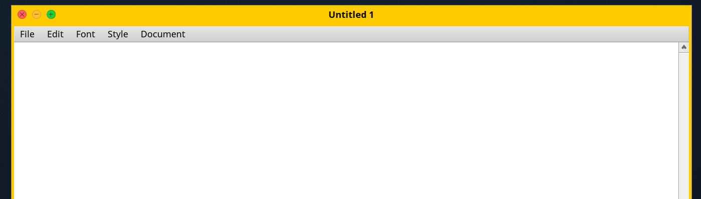
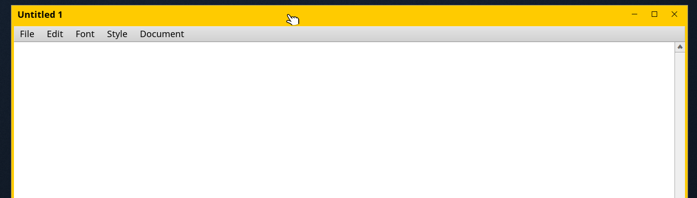

# Window decorators: how BeOS, Haiku and Prose draw a window's chrome

*The title bar, the buttons, the border and the resize corner of every window
are drawn by the app_server, not by the application. The object that draws
them is a decorator. This is how that works, what it costs to write one, and
what Prose now ships.*

Every path below is in `/Volumes/HaikuSrc/haiku`, on the `prose` branch.

## 1. Where the chrome comes from

A Be application never draws its own frame. `BWindow` describes what it wants
— a *look* (`B_TITLED_WINDOW_LOOK`, `B_DOCUMENT_WINDOW_LOOK`,
`B_FLOATING_WINDOW_LOOK`, `B_MODAL_WINDOW_LOOK`, `B_BORDERED_WINDOW_LOOK`,
`B_NO_BORDER_WINDOW_LOOK`) and *flags* (`B_NOT_CLOSABLE`, `B_NOT_ZOOMABLE`,
`B_NOT_MINIMIZABLE`, `B_NOT_RESIZABLE`, …) — and the server does the rest. In
BeOS R5 the look was a fixed part of the app_server: the yellow tab, and,
behind an easter egg, three hidden alternatives resembling Mac OS 8, Windows
95 and AmigaOS. Haiku rebuilt the server and made the look a loadable add-on;
its `MacDecorator` and `WinDecorator` are re-creations of those hidden R5
looks, and `BeDecorator` is R5's own.

Prose runs Haiku's app_server unchanged in this respect, so all of the below
is Haiku's design.

## 2. The classes

| class | file | what it is |
|---|---|---|
| `Decorator` | `src/servers/app/decorator/Decorator.h` | The abstract base. One per window. Owns the client frame, the border rects, a list of **tabs**, the drawing engine and draw state, and the *footprint*. Declares everything a look must implement. |
| `Decorator::Tab` | same | One title: its text, look, flags, the rects of the tab and the three buttons, which buttons are pressed, whether it has focus, the truncated title, and per-tab bitmap caches. A window normally has one; stack-and-tile puts several windows' tabs on one bar. |
| `Decorator::Region` | same | What a point hits: `REGION_TAB`, the three buttons, four borders, four corners, or nothing. The decorator answers `RegionAt()`; the behaviour decides what that means. |
| `TabDecorator` | `TabDecorator.h/.cpp` | The BeOS *tab model*: border rects, a tab sized from the font and the title, the tab's position along the bar (`tabLocation`, sliding with Shift), several tabs side by side, button geometry. Everything that is a tab rather than a bar lives here. |
| `DefaultDecorator` | `DefaultDecorator.h/.cpp` | The yellow tab. Gradients, button bitmaps cached per colour and size, the striped resize knob. It is compiled *into* app_server and is the fallback when no add-on is chosen or one fails to load. |
| `SATDecorator` | `src/servers/app/stackandtile/SATDecorator.h` | Stack-and-tile: the highlight colours when a window is being snapped to or stacked on another, plus `SATWindowBehaviour`. Add-ons subclass this. |
| `DefaultWindowBehaviour` | `DefaultWindowBehaviour.cpp` | Turns a click on a region into an action: drag from the tab or any border, close/zoom/minimize, slide the tab with Shift, **resize from the bottom-right corner only** with the primary button; from any border with the secondary button or the window modifier. The other three corners are a `TODO` and drag. This is independent of the decorator. |
| `DecorManager` / `DecorAddOn` | `DecorManager.h/.cpp` | Loads an add-on (`load_add_on`, then the C symbol `instantiate_decor_addon`), keeps *one* current decorator for every window, previews one on a single window, and remembers the choice. |

### The add-on contract

An add-on is a shared object that exports one function:

```cpp
extern "C" DecorAddOn* instantiate_decor_addon(image_id id, const char* name);
```

It returns a `DecorAddOn` whose `_AllocateDecorator()` news the decorator. The
add-on links against app_server itself (`Addon X : … : be <nogrist>app_server`
in its Jamfile), which is why it must be built from the same tree as the
running server. A resource `be:decor:info` (a `.rdef` message with `name`,
`authors`, `short_descr`, `long_descr`, `lic_name`, `lic_url`,
`support_url`, `version`) is what the Appearance preferences show. The
directory is compiled with `-Werror`.

### What a decorator implements

The pure virtuals in `Decorator.h`, in the order they matter:

- `_DoLayout()` — from `fFrame` (the client area) compute everything else:
  `fLeftBorder`/`fRightBorder`/`fTopBorder`/`fBottomBorder` (strips, not
  overlapping, the sides without the corners — the base class's dirty-region
  code relies on that shape), `fBorderRect`, `fTitleBarRect`, `fResizeRect`,
  and each tab's `tabRect`, `closeRect`, `zoomRect`, `minimizeRect`.
- `_GetFootprint(BRegion*)` — the pixels the decorator owns. Everything in it
  is drawn by the decorator and *only* by the decorator; there is no
  transparency, so a region you claim you must paint.
- `RegionAt(BPoint, int32& tab)` — hit-testing. The base handles close, zoom
  and the tab rect; borders, corners and minimize are yours.
- `_DrawFrame(BRect)`, `_DrawTab(Tab*, BRect)`, `_DrawTitle`, `_DrawButtons`,
  `_DrawClose/_DrawZoom/_DrawMinimize(Tab*, bool direct, BRect)` — drawing,
  always inside an update rect. `direct` means "straight to the front
  buffer": pressed-button feedback.
- `_SetTitle`, `_SetFocus`, `_MoveBy`, `_ResizeBy(offset, BRegion* dirty)` —
  state changes; `_ResizeBy` must say which strips need repainting, and only
  those, or every resize repaints the whole window.
- `_AddTab`, `_RemoveTab`, `_MoveTab`, `_SetTabLocation` — the multi-tab and
  sliding-tab protocol; a look may decline them (`return false`).
- `UpdateColors(DesktopSettings&)` — called at creation and whenever the
  system colours change.

### Drawing

`DrawingEngine` (`src/servers/app/drawing/DrawingEngine.h`) is the whole
palette: `StrokeLine`, `StrokeRect`, `FillRect` (solid or `BGradientLinear`),
`FillRegion`, `DrawEllipse`, `DrawRoundRect`, `DrawTriangle`, `DrawShape`,
`DrawBitmap`, `DrawString`, `StringWidth`, pen size and stroke mode, drawing
modes. It renders through AGG, so shapes are anti-aliased. Fonts are
`ServerFont`s from `DesktopSettings::GetDefaultBoldFont()` (titled windows)
and `GetDefaultPlainFont()` (floating ones), 12 pt by default; every good
decorator derives every size from the font, so a bigger system font gives a
bigger frame.

### Colours

`DesktopSettings::UIColor(color_which)`. The six that are a decorator's:

| colour | default |
|---|---|
| `B_WINDOW_TAB_COLOR` | 255, 203, 0 — the BeOS yellow |
| `B_WINDOW_TEXT_COLOR` | 0, 0, 0 |
| `B_WINDOW_INACTIVE_TAB_COLOR` | 232, 232, 232 |
| `B_WINDOW_INACTIVE_TEXT_COLOR` | 80, 80, 80 |
| `B_WINDOW_BORDER_COLOR` | 224, 224, 224 |
| `B_WINDOW_INACTIVE_BORDER_COLOR` | 232, 232, 232 |

(`src/kits/interface/InterfaceDefs.cpp`, `_kDefaultColors`; there is a
second table, `_kDefaultColorsDark`, with a dark palette.) The user changes
them in Appearance; `set_ui_color()` changes them from a program; app_server
persists them. A decorator that reads these is restyled by a theme for free.
`TabDecorator::UpdateColors()` derives light, bevel and shadow tints from the
tab colour, and `DefaultDecorator::GetComponentColors()` hands out the right
set for a component given its highlight — asking that, rather than choosing
colours yourself, is what keeps stack-and-tile and resize highlighting
working in a new look.

### Choosing one

- **Settings:** `~/config/settings/system/app_server/decorator_settings`, a
  flattened `BMessage` with one string, `decorator`: a path, or `"Default"`.
  Read once at app_server start; written by `DecorManager::SetDecorator`.
- **Switching live:** `Desktop::ReloadDecor()` gives every window a new
  decorator from the new add-on and redraws; the old image is unloaded after.
  Nothing restarts.
- **Client API** (`headers/private/interface/DecoratorPrivate.h`):
  `BPrivate::get_decorator`, `set_decorator`, `preview_decorator`.
  `DecorInfoUtility` (`DecorInfo.h`) scans four directories —
  `add-ons/decorators` under system, system non-packaged, user, and user
  non-packaged — and reads each add-on's `be:decor:info`. That is what the
  **Appearance** preferences list and what **`setdecor`** uses:
  `setdecor -s` lists shortcut names (the file name), `setdecor <name>` sets
  one, `setdecor -p <name>` previews. `setdecor` is in the Prose image.
- **The name shown is the file name.** `DecorInfo::_Init()` reads the
  resource's `name` and then overwrites it with the file's name
  (`src/kits/interface/DecorInfo.cpp`, the last line of `_Init`), so
  Appearance and `setdecor` show `ProseDecorator`, not `Prose`, exactly as
  Haiku's own show `BeDecorator`. The description, authors and licence do
  come from the resource.
- **A decorator without a rebuild:** copy the add-on into
  `~/config/non-packaged/add-ons/decorators/` and it appears in Appearance.
  This is how the ones below were tested before they were packaged.

### Two limits worth knowing

- **No hover.** `SetRegionHighlight()` is called only for resize borders. A
  decorator is never told the pointer is over a button, so the macOS habit of
  showing the button glyphs on hover cannot be done; glyphs are always drawn,
  or never.
- **Corners.** Resizing with the primary button works from the bottom-right
  corner and, for document windows, the knob. The other corners drag. That is
  `DefaultWindowBehaviour`, not the decorator; a conventional
  resize-from-any-edge would be a change to app_server.

### What ships

Haiku packages `BeDecorator` and `FlatDecorator` in `haiku_extras`
(`build/jam/packages/HaikuExtras`); `MacDecorator` and `WinDecorator` are in
the tree but no package lists them. **The Prose image has never included
`haiku_extras`**, so until now the only decorator on a Prose machine was
Default, and the Appearance menu had one entry.

## 3. What Prose adds: two conventional frames

Patches `0068` and `0069`: `src/add-ons/decorators/ProseDecorator` and
`ProseRightDecorator`, packaged into `haiku.hpkg` by
`build/jam/packages/Haiku`. (0069 is the first bug found: a window that
grew taller kept the wallpaper in the rows its left strip grew into,
because `_ResizeBy` never marked them dirty and the desktop repaints only
what a resize exposes of the client area. TabDecorator marks that strip;
now this one does.)

| | Prose | Prose Right |
|---|---|---|
| title bar | full width, one colour with the frame | same |
| buttons | round close, minimize, zoom at the left | minimize, zoom, close glyphs at the right |
| title | centred; clear of the buttons if the bar is narrow | at the left |
| add-on file | `ProseDecorator` | `ProseRightDecorator` |




The design, and why each part is the way it is:

- **One class, two add-ons.** `ProseDecorator` takes a `ButtonSide`; the two
  add-on directories compile the same source under their own grist. There is
  no duplicated drawing code.
- **On `SATDecorator`, not `TabDecorator`'s tab model.** Subclassing the
  stack-and-tile decorator keeps its highlighting and the standard behaviour;
  only `_DoLayout` and the drawing are replaced. The bar replaces the tab:
  `fTitleBarRect` sits on the top border and spans the frame, and
  `fBorderRect` runs around bar and borders together so one outline encloses
  the whole.
- **Sized from the font.** Bar height = ascent + descent + 2 × ⌈size/3⌉ (≈ 23
  px at 12 pt); round buttons ⌈size⌉ across, glyph buttons 1.6 × 1.25 sizes;
  border 4 px × (size/12), 3 for floating windows, 1 for bordered ones. The
  resize-corner grab length and the document knob use Haiku's own values,
  scaled.
- **Every colour through `GetComponentColors()`.** The bar is
  `COLOR_TAB`, the title `COLOR_TAB_TEXT`, the outline
  `COLOR_TAB_FRAME_DARK` (the border colour darkened), for the focused or
  unfocused state as the family computes them; a border strip that is
  highlighted — resize, or stack-and-tile — takes the family's highlight
  colour for that strip. Nothing is hard-coded except the three round
  buttons' red, amber and green, which are the convention that arrangement
  borrows; they grey out when the window is inactive.
- **Stacked windows are slices.** With more than one tab the bar is divided
  equally; every slice has its own close button and title, a rule between
  slices, and only the top tab carries minimize and zoom. `_MoveTab` and
  `_SetTabLocation` decline, so slices keep their order and do not slide.
- **The three looks.** Titled and document windows get the bar (document
  windows also the knob, painted with three grip lines, since the knob
  reaches into the client area and must be drawn). Modal windows keep Haiku's
  frame-only look. Floating windows get a smaller bar in the plain font.
- **Pressed feedback** draws straight to the front buffer, as
  `DefaultDecorator` does; there is no bitmap cache, the primitives are cheap.

### Verified

On a saved test image, headless, with the sequence scripted in the guest and
captures taken on the host (`docs/automation.md`): both variants draw titled
(Terminal), document (StyledEdit) and modal (alert) windows, focused and
unfocused; the floating look (Terminal's Find window) gets the smaller bar
in the plain font; a scripted click on the close button closes the window,
so footprint, hit-testing and behaviour agree; switching decorators live and
back leaves every window intact. Resizing, the case patch 0069 fixes: a
window moved, grown thirty times by 15 px and once by 600×800 through
`hey StyledEdit set Frame of Window "Untitled 1" to "BRect(…)"` keeps every
strip painted, where before the fix the rows the left strip grew into kept
the wallpaper. (StyledEdit's `Window 0` is its hidden Open panel; the
document must be addressed by title.) Not yet exercised: a stacked bar on
screen and the resize highlight during a drag — both need a drag with a
modifier held, which the automation cannot do yet — and minimize and zoom
clicks.

### Using them

Appearance ▸ Decorator, or from a shell — including through the Prose portal
from the host:

```
setdecor ProseDecorator
setdecor ProseRightDecorator
setdecor Default
```

## 4. Themes

A theme is a wallpaper, a set of system colours and a decorator, chosen from
the host's View ▸ Theme menu and applied to the guest through the portal.
Patch `0072`; host side in `tools/hvgpu/themes.swift`.

**In the guest: `prosetheme`.** A theme is `NAME.theme` in
`/boot/system/data/prose/themes` (shipped, in the `prose_portal` package) or
`~/config/settings/prose/themes` (the user's, which win), lines of
`key = value`:

```
decorator = ProseDecorator                  a decorator's name as setdecor knows it
wallpaper = /boot/system/data/artwork/PROSE wallpaper - paper light.png
window_tab = 236,236,236                    a colour, r,g,b
```

The colour keys are the system's: `panel_background`, `panel_text`,
`document_background`, `document_text`, `control_*`, `menu_*`, `list_*`,
`link_*`, `tooltip_*`, `scroll_bar_thumb`, `status_bar`, `success`,
`failure`, the six `window_*` colours, and `desktop` (which also decides
whether Tracker draws the icons' labels light or dark). A key a theme leaves
out keeps its current value, so a theme may be partial.

| | |
|---|---|
| `prosetheme --list` | the themes there are; `* ` marks the current one |
| `prosetheme --current` | the current theme's name |
| `prosetheme --show NAME` | what a theme sets |
| `prosetheme NAME` | apply it |

Each part goes to the server that owns it — colours through `set_ui_color()`,
the decorator as `setdecor` sets it, the wallpaper as the Backgrounds
preferences write it (the `be:bgndimginfo` attribute on the Desktop folder,
then `B_RESTORE_BACKGROUND_IMAGE` to Tracker) — and each of those persists
it, so a theme applied once is the machine's state across restarts. The name
is kept in `~/config/settings/prose/theme`.

**Three ship.** *Prose Light*: the paper wallpaper, a light grey frame with
the round buttons at the left, the system's own colours otherwise. *Prose
Dark*: the ink wallpaper, a charcoal frame, and Haiku's dark palette for
panels, menus, documents and lists. *Classic*: the yellow tab and the default
colours a new machine has. All three list every colour, so switching back
restores everything.

**On the host: View ▸ Theme.** The submenu is filled from `prosetheme --list`
when the guest's portal daemon says hello (a couple of seconds into a boot),
the current theme carries the check mark, and choosing one runs
`prosetheme NAME` and moves the mark when the guest confirms. The portal is
attached to every machine now — the automation switch gates other
applications, not the machine's own menus. The same path is the `theme`
automation command (`docs/automation.md`), which is how it is tested.

A fourth theme is a text file: drop `Mine.theme` in
`~/config/settings/prose/themes` and it is in the menu at the next boot.
